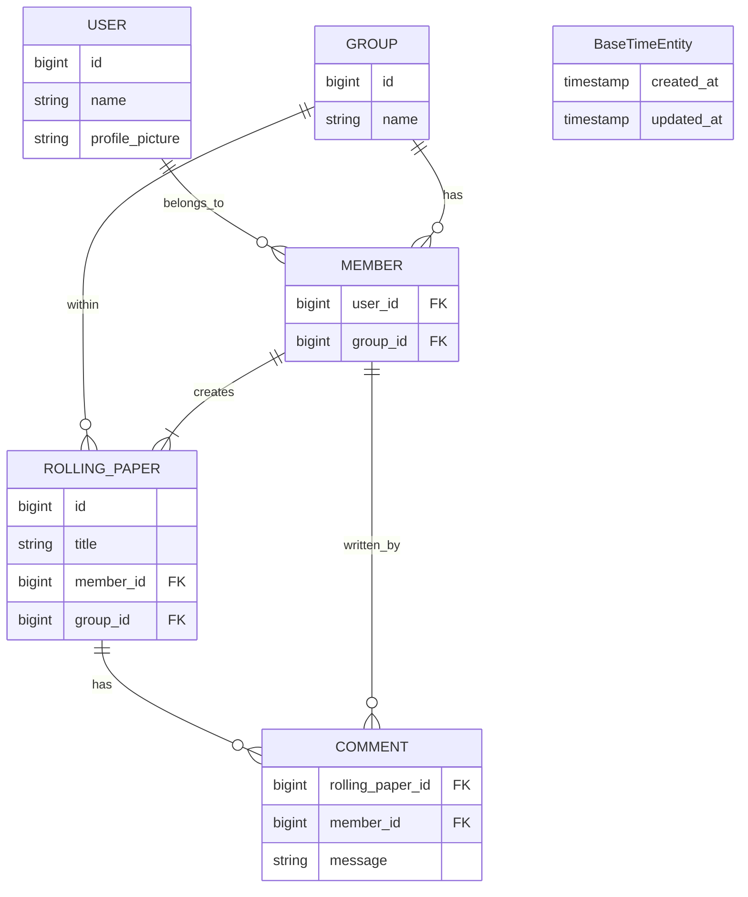

# Toyou-mermaid ERD

```mermaid
erDiagram
    USER ||--o{ MEMBER: belongs_to
    USER {
        bigint id
        string name
        string profile_picture
    }

    GROUP ||--o{ ROLLING_PAPER: within
    GROUP {
        bigint id
        string name
    }

    GROUP ||--o{ MEMBER: has
    MEMBER {
        bigint user_id FK
        bigint group_id FK
    }

    MEMBER ||--|{ ROLLING_PAPER: creates
    ROLLING_PAPER {
        bigint id
        string title
        bigint member_id FK
        bigint group_id FK
    }

    ROLLING_PAPER ||--o{ COMMENT: has
    MEMBER ||--o{ COMMENT: written_by
    COMMENT {
        bigint rolling_paper_id FK
        bigint member_id FK
        string message
    }

    BaseTimeEntity {
        timestamp created_at
        timestamp updated_at
    }
```

### Details

- `USER`: 사용자 정보
- `GROUP`: 그룹 (사용자들의 모임)
- `MEMBER`: 그룹에 속한 사용자
- `ROLLING_PAPER`: 그룹 내에서 공유되는 메시지
- `COMMENT`: 롤링페이퍼에 작성된 댓글
